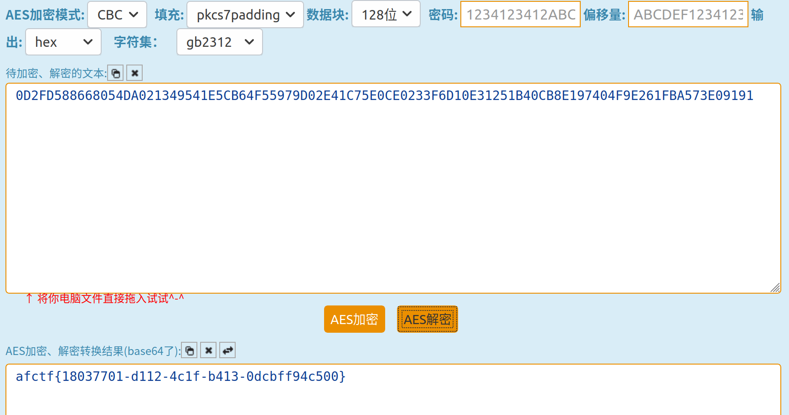

## Login

- 流量分析，能提取出`login.html`的网页源码

  ```html
  <!DOCTYPE html>
  <html lang="en">
      
      <head>
          <meta charset="UTF-8" />
          <meta name="viewport" content="width=device-width, user-scalable=no, initial-scale=1.0, maximum-scale=1.0, minimum-scale=1.0" />
          <title>Login</title>
      </head>
      
      <body>
           <h1>Login</h1>
  
          <script src="https://cdnjs.cloudflare.com/ajax/libs/crypto-js/3.1.9-1/crypto-js.js"></script>
          <script src="https://code.jquery.com/jquery-3.4.1.slim.min.js" integrity="sha256-pasqAKBDmFT4eHoN2ndd6lN370kFiGUFyTiUHWhU7k8=" crossorigin="anonymous"></script>
          <script>
              const key = CryptoJS.enc.Utf8.parse("1234123412ABCDEF");
              const iv = CryptoJS.enc.Utf8.parse('ABCDEF1234123412');
  
              function checkform_login() {
                  if ($("#username").val() == "") {
                      $("#username").focus();
                      alert("请输入您的账号！")
                      return false
  
                  } else if ($("#password").val() == "") {
                      $("#password").focus();
                      alert("请输入您的密码！")
                      return false
  
                  } else {
  
                      $("#u_dlcode").val(Encrypt($("#username").val()))
                      $("#p_dlcode").val(Encrypt($("#password").val()))
  
                      $("#form_login_true").submit();
                      return true
                  }
              }
  
  
  
              //加密方法
              function Encrypt(word) {
                  let srcs = CryptoJS.enc.Utf8.parse(word);
                  let encrypted = CryptoJS.AES.encrypt(srcs, key, {
                      iv: iv,
                      mode: CryptoJS.mode.CBC,
                      padding: CryptoJS.pad.Pkcs7
                  });
                  return encrypted.ciphertext.toString().toUpperCase();
              }
          </script>
          <form id="form_login" name="form_login" action="javascript:;" method="post">
              <input name="username" id="username" type="text" maxlength="20" hidefocus="true" />
              <input name="password" id="password" type="password" hidefocus="true" />
              </td>
              <input type="button" name="Submit" id="dlbutton" value="登录系统" onclick="checkform_login()" />
          </form>
          <!--用户输入完成后，真实POST提交的表单 -->
          <form id="form_login_true" name="form_login_true" action="index.html" method="post">
              <input name="u_dlcode" id="u_dlcode" type="hidden" value="" />
              <input name="p_dlcode" id="p_dlcode" type="hidden" value="" />
          </form>
      </body>
  
  </html>
  ```

  用户名和密码经AES加密后提交给表单，加密后的用户名为`u_dlcode`，密码为`p_dlcode`，分别能在下一个包中找到：

  > key = 1234123412ABCDEF
  >
  > iv = ABCDEF1234123412
  >
  > u_dlcode = F6889AA527EA40FB0A2AECC5A28A694E
  >
  > p_dlcode = 0D2FD588668054DA021349541E5CB64F55979D02E41C75E0CE0233F6D10E31251B40CB8E197404F9E261FBA573E09191
  >
  > mode: CBC
  > padding: Pkcs7

  在这里[解密](http://tool.chacuo.net/cryptaes)，得到用户名为`admin`，密码即为flag：

  