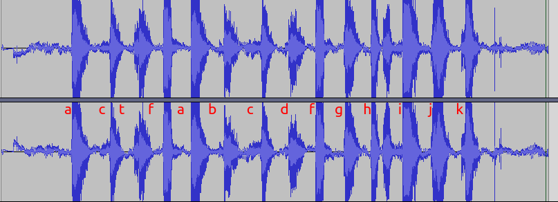

## music

- 给了一个`m4a`文件但是，用`file`没识别出来

  ```shell
  % file vip.m4a 
  vip.m4a: data
  ```

- 于是查了一下`m4a` 文件头是`00 00 00 20 66 74 79 70 4D 34 41 20 00 00 00 00`

  而这个文件的文件头却是：`a1 a1 a1 b9 c7 d5 d8 d1 cc d1 95 93 a1 a1 a1 a1`

  应该是和`0xa1`异或了，解出来`m4a`然后播放，原来是道听力题.....

  