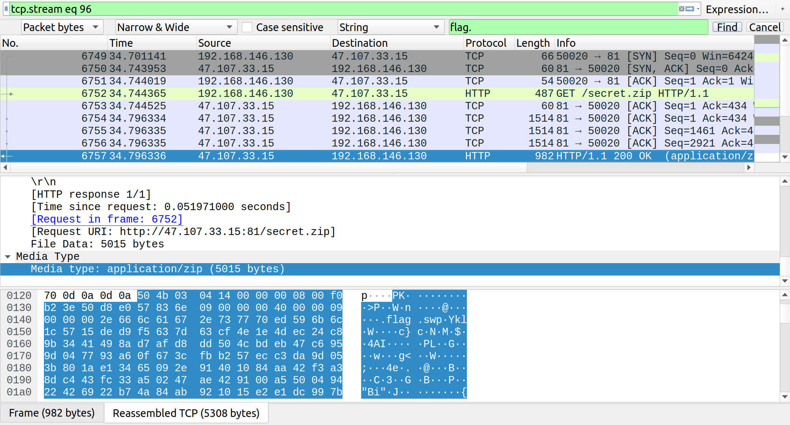

## SWP

wireshark打开流量包，搜索flag发现压缩包一个



尝试解压，发现有密码，直接用binwalk能解出来flag文件

是个elf64，直接搜索字符串就有flag

```shell
% rabin2 -zz flag| grep {
17  0x000006d9 0x000006d9 42  43 ascii  actf{c5558bcf-26da-4f8b-b181-b61f3850b9e5}
```

并不知道这题给的swp文件有啥用...

