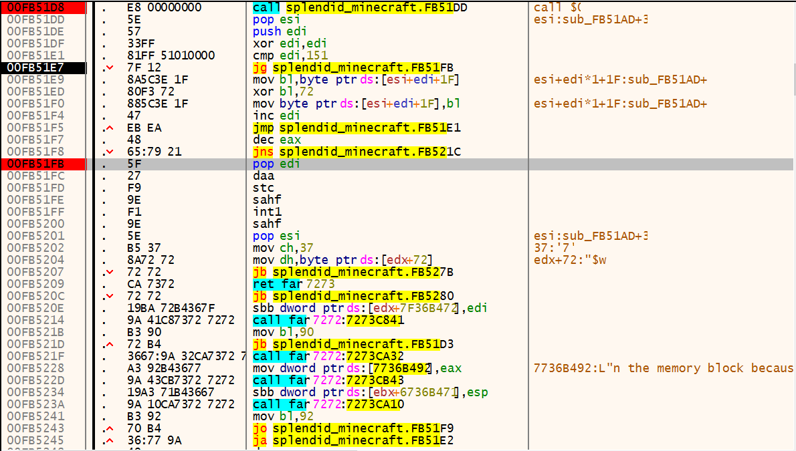
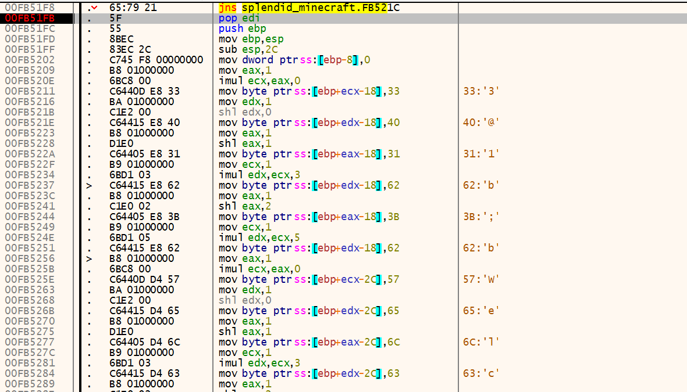
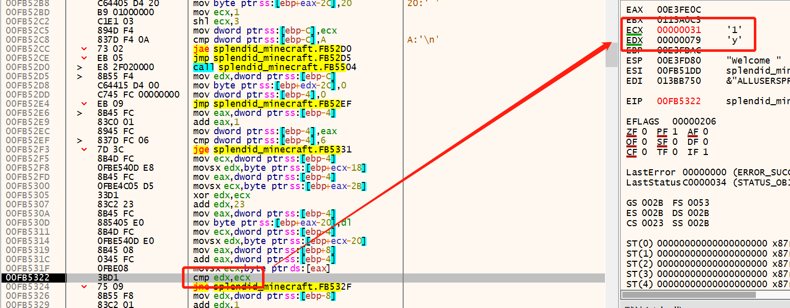
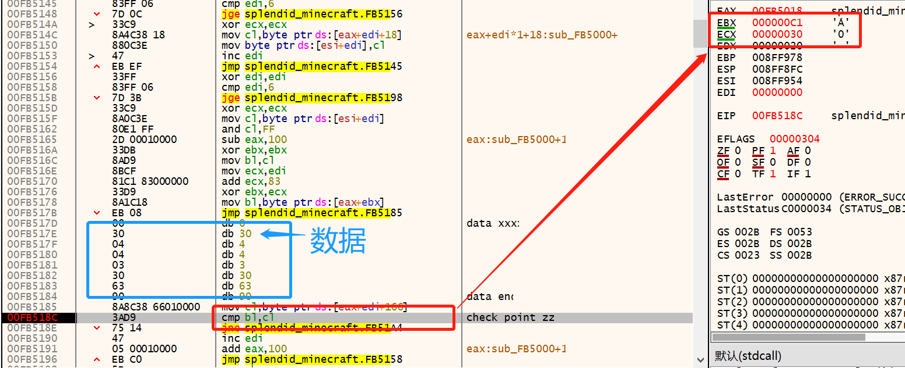
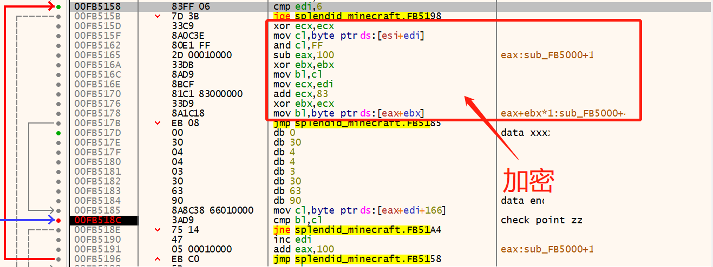
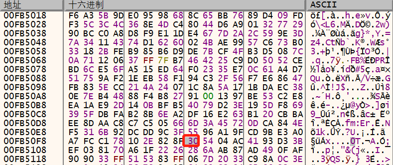
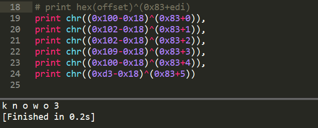
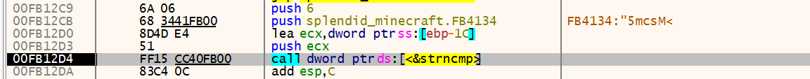

## Splendid_MineCraft

- 考点：动态调试（后来看了hint，原来叫做自修改代码...*SMC self-Modifying Code*）

    ```c
    int sub_401080(){
      char *part1; // eax
      char *part2; // eax
      char *part3; // ST28_4
      signed int i; // [esp+14h] [ebp-54h]
      int v5; // [esp+20h] [ebp-48h]
      char Str1; // [esp+24h] [ebp-44h]
      char endc; // [esp+3Dh] [ebp-2Bh]
      int p2_0; // [esp+44h] [ebp-24h]
      __int16 p2_2; // [esp+48h] [ebp-20h]
      char p3_0[4]; // [esp+4Ch] [ebp-1Ch]
      __int16 p3_2; // [esp+50h] [ebp-18h]
      int pl_0; // [esp+54h] [ebp-14h]
      __int16 p1_4; // [esp+58h] [ebp-10h]
      int p1_0_; // [esp+5Ch] [ebp-Ch]
      __int16 p1_4_; // [esp+60h] [ebp-8h]
    
  printf(&aS, "Welcome to ACTF_Splendid_MineCraft!");
      scanf(&aS2, &Str1);
      if ( strlen(&Str1) == 26 )
      {
        if ( !strncmp(&Str1, "ACTF{", 5u) && endc == '}' )
        {
          endc = 0;
          part1 = strtok(&Str1, "_");
          pl_0 = *(part1 + 5);                      // ACTF{123456_abcdef_ABCDEF}
                                                    // 01234567890123456789012345
          p1_4 = *(part1 + 9);
          p1_0_ = *(part1 + 5);
          p1_4_ = *(part1 + 9);
          part2 = strtok(0, "_");
          p2_0 = *part2;
          p2_2 = *(part2 + 2);
          part3 = strtok(0, "_");
          *p3_0 = *part3;
          p3_2 = *(part3 + 2);
          ptr = func;
          if ( func(&pl_0) )
          {
            v5 = SBYTE2(p1_0_) ^ SHIBYTE(p1_4_) ^ p1_0_ ^ SHIBYTE(p1_0_) ^ SBYTE1(p1_0_) ^ p1_4_;
            for ( i = 0x100; i < 0x1F0; ++i )
              loc_405018[i] ^= v5;
            JUMPOUT(__CS__, &loc_405018[256]);
          }
          printf("Wrong\n");
        }
        else
        {
          printf("Wrong\n");
        }
      }
      else
      {
        printf("Wrong\n");
      }
      return 0;
    }
    ```

### 0x0 确定flag结构

- flag长度为26字节，除去`ACTF{}`还剩下20字节的`flag`

  使用`strtok`将20字节的`flag`分为三部分，其中有2字节是`_`

  还剩下18字节分析一下，不难看出每部分6字节

- flag结构为`ACTF{123456_abcdef_ABCDEF}`

### 0x1 动态分析

- 检查flag第一部分和第二部分的函数都在数据段，而且是经过异或编码的，于是只能动态调试

#### 第一部分

- 第一部分的函数如下（解码前）：

  

- 这个函数解码的操作是异或`0x72`，解码后：

  

- 直接去找字符比较的cmp指令：

  

- 输入的字符串是`ACTF{123456_abcdef_ABCDEF}`，这里是逐字节的明文对比，比较简单

  对比6个字符后，能得到flag第一部分：`yOu0y*`

#### 第二部分

- 检查flag第二部分的函数需要通过刚解出的flag第一部分来解码

  解码的操作是异或`yOu0y*`这六字节异或后的结果

- 因此，将输入的字符串改为`ACTF{yOu0y*_abcdef_ABCDEF}`

  

- 这里不是明文对比，输入的`a`被加密成了`0xc1`，加密过程如下：

  

- 加密：`y = eax[ ( x & 0xff) ^ 0x83 + edi ]`

  其中`edi`用作计数范围是0~5，`eax`可以看出是个数组：

  

- 解密：`x = eax.offset(y) ^ (0x83 + edi)`

  其中`y`对应的是上上上面那张图中蓝框框起来的部分（数据夹在代码中hhhh）

  `y = [0x30, 0x4, 0x4, 0x3, 0x30, 0x63]`

  根据`y`的值查表，得到对应的偏移量，即可解得`x`：



- flag第二部分：`knowo3`

#### 第三部分

- 本来以为第三部分会更困难，没想到是直接用的`strcmp`明文对比...

  

- flag第三部分：`5mcsM<`