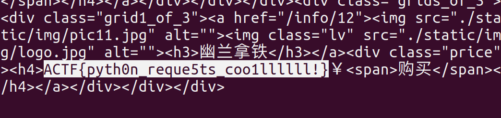

## 茶颜悦色

- 网站链接都是假的...只有翻页能点...查看源码有提示：
    ```html
    <!--找一找我最喜欢喝的幽兰拿铁!-->
    ```

- 于是写脚本自动翻页：

  ```python
  #!/usr/bin/python3
  #__author__:TaQini
  import requests
  
  # header
  s=requests.session()                                     
  s.headers['Accept']='text/html,application/xhtml+xml,application/xml;q=0.9,image/webp,image/apng,*/*;q=0.8'
  s.headers['Accept-Encoding']='gzip, deflate, br'
  s.headers['Host']='url'                 
  s.headers['Accept-Language']='zh-CN,zh;q=0.9,en;q=0.8,ja;q=0.7,ko;q=0.6'
  s.headers['User-Agent']='zilla/5.0 (Windows NT 10.0; WOW64) AppleWebKit/537.36 (KHTML, like Gecko) Chrome/68.0.3440.106 Safari/537.36'
  
  url = 'http://47.106.94.13:40004'
  
  # get
  def get_data(i):                          
      res = s.get(url,params={'page':str(i)})
      res.encoding = res.apparent_encoding
      return res.text 
  
  i=0
  while True:
      print('page %d'%i)
      t = get_data(i)
      i+=1
      if '幽兰拿铁' in t[1000:]:
          print(t[1000:])
          break
  ```

  找到拿铁就给`flag`啦：

  