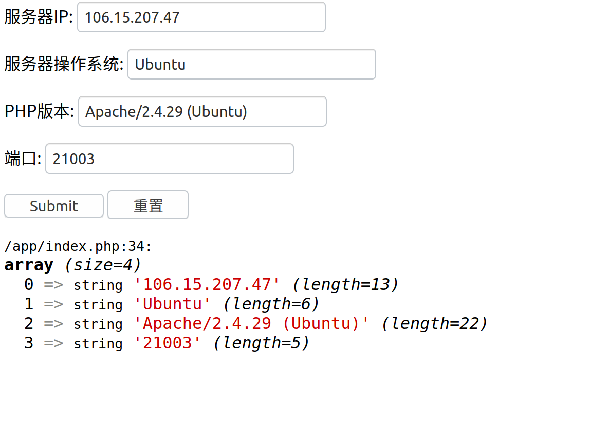
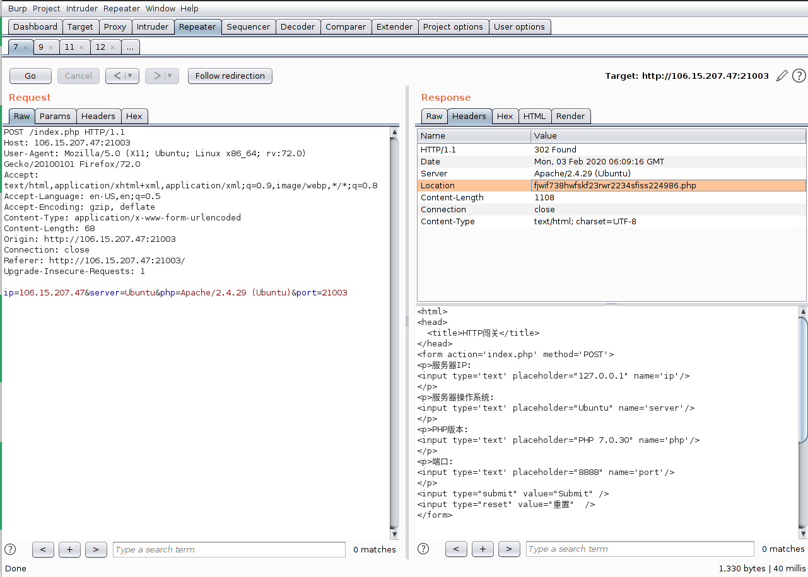
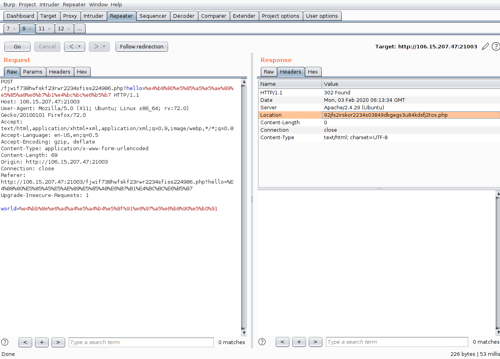
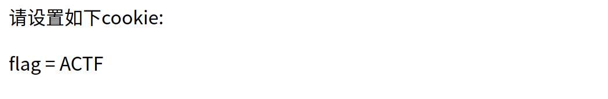
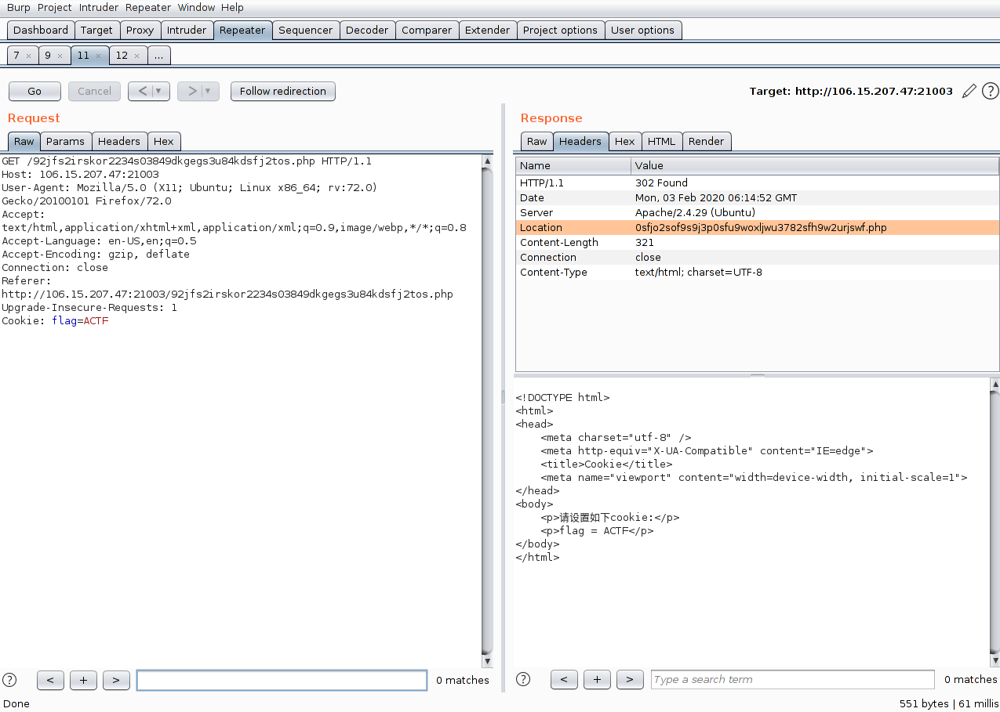
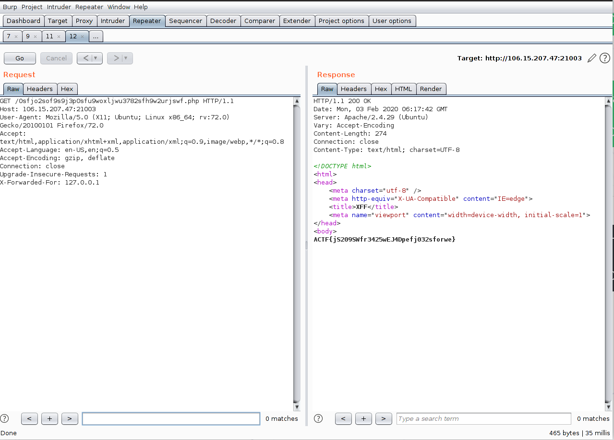

## easyHTTP

- 题目界面：

- 将对应的信息填好，提交后在`header`中给出下一个`php`的位置：

  

- 访问之：

  

- 按照要求发送参数，然后在`header`中又给出下一个`php`的位置：

  

- 访问之：

  

- 按照要求发送`cookie`，然后在`header`中又给出下一个`php`的位置：

  

- 访问之：
  

- 按照要求`XFF`，最终拿到flag：

  