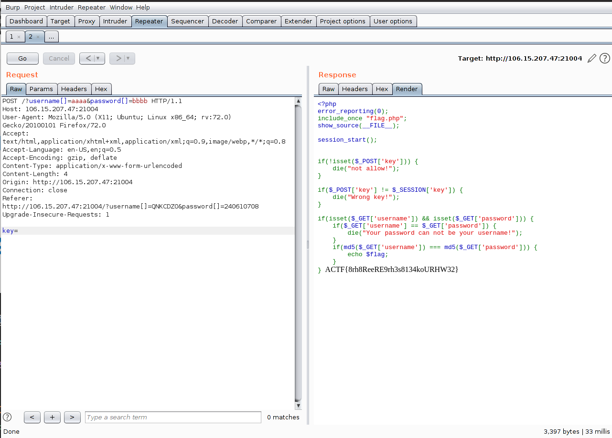

## easyphp

```php
 <?php
error_reporting(0);
include_once "flag.php";
show_source(__FILE__);

session_start();


if(!isset($_POST['key'])) {
    die("not allow!");
}

if($_POST['key'] != $_SESSION['key']) {
    die("Wrong key!");
}

if(isset($_GET['username']) && isset($_GET['password'])) {
    if($_GET['username'] == $_GET['password']) {
        die("Your password can not be your username!");
    }
    if(md5($_GET['username']) === md5($_GET['password'])) {
        echo $flag;
    }
} 
```

- `$_SESSION['key']`中并没有值，所以``$_POST['key']`传空值可绕过

- 数组绕过，传入`md5`函数的参数为数组类型时返回`null`，`null===null`



