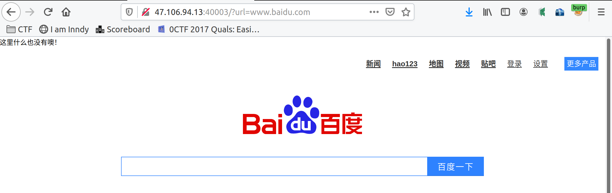
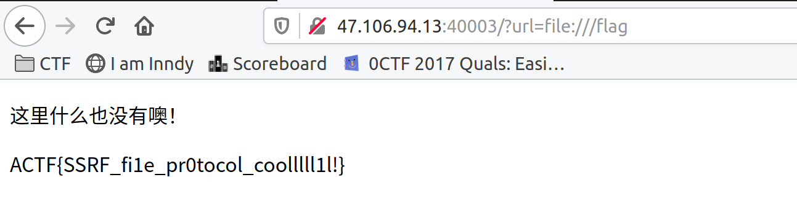

## easyweb

- 查看源码，给了hint：

  ```html
  <!--Nzc3Nzc3MmU2MjYxNmI=heiheihei-->
  ```

  解base64，解hex，得到www.bak

  ```python
  In [1]: s='Nzc3Nzc3MmU2MjYxNmI='
  
  In [2]: s.decode('base64')
  Out[2]: '7777772e62616b'
  
  In [3]: '7777772e62616b'.decode('hex')
  Out[3]: 'www.bak'
  ```

  下载下来，发现是个zip，解压后给了flag位置（`/flag`）和源码：

  ```php+HTML
  <!DOCTYPE html>
  <html>
  <head>
      <meta charset="utf-8" />
      <meta http-equiv="X-UA-Compatible" content="IE=edge">
      <title>找找hint吧</title>
      <meta name="viewport" content="width=device-width, initial-scale=1">
  </head>
  <body>
  <p>这里什么也没有噢！</p>
  <!--Nzc3Nzc3MmU2MjYxNmI=heiheihei-->
  </body>
  <?php
  //学习一下如何利用下面的代码?
  //请不要用来做"越界"的操作
  error_reporting(0);
  function curl($url){  
      // 创建一个新cURL资源
      $ch = curl_init();
      // 设置URL和相应的选项
      curl_setopt($ch, CURLOPT_URL, $url);
      curl_setopt($ch, CURLOPT_HEADER, 0);
      // 抓取URL并把它传递给浏览器
      curl_exec($ch);
      // 关闭cURL资源，并且释放系统资源
      curl_close($ch);
  }
  
  $url = $_GET['url'];
  curl($url); 
  ?>
  </html>
  ```

  有一个`curl($url)`函数，试了下跟linux的`curl`命令差不多，功能就是访问目标`url`

  

  直接访问服务器本地的`/flag`即可

  

