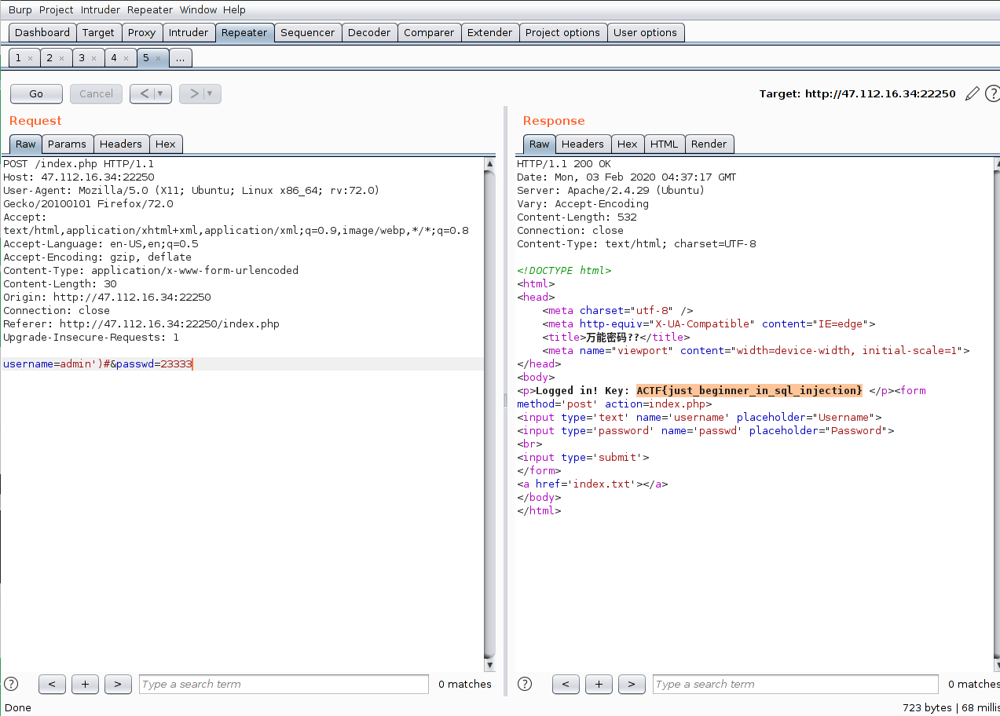

## universal_sql

查看源代码，有个`index.txt`，里面是源码：

```php
$username = $_POST[username];
$passwd = md5($_POST[passwd]);
$sql = "select username from users where (username='$username') and (pw='$passwd')";
```

构造`sql`语句，注释掉查询`pw`的部分：

```mysql
select username from users where (username='admin')#') and (pw='$passwd')";
```

用户名是`admin`时显示登录成功：

