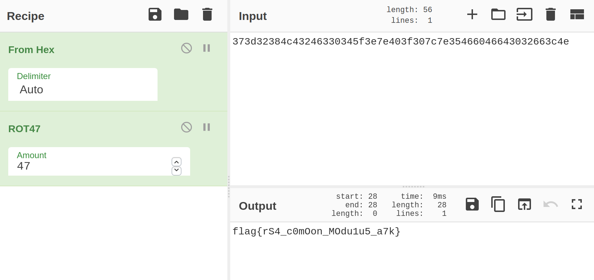

## Ridicule

- 题目描述：

  > 你想要窃听Alice与Bob之间的通信，但他们使用了RSA加密，你无法破解。他们也知道这一点，为了嘲讽你，甚至把同一条消息发送了两次！ 
  >
  > By *Mercurio*

 - [题目附件](https://cdn.jsdelivr.net/gh/SignorMercurio/MetasequoiaCTF@master/Crypto/Ridicule/attachment.zip)

 - 考察点：RSA共模攻击

 - 难度：简单

 - 初始分值：150

 - 最终分值：124

 - 完成人数：8

RSA共模攻击[参考](https://www.jianshu.com/p/2d95bdd0fb0d)

```python
#!/usr/bin/python
#__author__:TaQini

import sys

def egcd(a, b):
    if a == 0:
        return (b, 0, 1)
    else:
        g, y, x = egcd(b % a, a)
    return (g, x - (b // a) * y, y)

def modinv(a, m):
    g, x, y = egcd(a, m)
    if g != 1:
        raise Exception('modular inverse does not exist')
    else:
        return x % m

sys.setrecursionlimit(1000000)
e1 = 65537
e2 = 395327
s = egcd(e1, e2)
s1 = s[1]
s2 = s[2]
c1 = 91305913831214369377952269118161386003598023255485037043787231386393955913536147951327587587463685458285050904908606519471516585546641448049728693190905879280840165324662394536944611092018044651371870986413401191811244830102613672620955502806522821766703471780501595829827875795245077468666876924554483719367619785416487802738542307755841705317059328580966011761532447398826642223971344197882218789319343867872361384139568302372092803096038907172887382345170895273112014635399900800642737687324107565370573604700095505442212165699978970932019423809817487089085601763117309208863650351775335912245447387452956788773428626555630061201067204115092554187354312571068755262098974796820411503610378273433454274777409673603938861625985976632847656111827263952716196589771597261150375688197316301237918777772060246839505840400511836084221123300725351892908105214743311210231911274804713194290807741144717602270672051963664718188579120547722073387555742534912295882639385513725274066607278662476330784799812834843237551921507530373632320031381036550506607567061408192533501338206431901557732808859610231949222985385162467033555818794827557794123641737919050344373856601672258488664080854100467312218803256169436644089734181008742490711580042
c2 = 704672807914934785540657591440512058022586636125385843168732955073514077655455813212009493863389059666899528836516095699125514067099710358014253776587605045075141314272189607334786100207510015707758739101384698920619364876535606210899911129217151741959517344988838631586846350008457359747129948031415545489245577138170245470822851099234206216384013980124363443997339235504467924028046028680088155373925683649047495400986970876581673756506916765485275724626482137125637187439908185652963713581266007823789444165379453792444581101766966160504792503774410227806705414033756780127831024884593928515162191834028847725582871710066858868947182430104633621199015107401148118418338824086178489351697402962464798943542690540041445116576626615679919422505195176433797369659680306125076741925059577683214898660950897895672017286721867404885976418884202714626278569772713938624652451293587114431454520793129201159777144870706434853118587971437409703156441560836614022558588075615856594959231216241788071137142857422791753028932100557615225152094338580103681806055204290166319011784438838989437111665407114828731652938898822052627483844276822323929616602820305955544961236345999748237725866983443344310328933228220159896431099123550617191875040204
n = 762292637561009841867381758891924078920161551681011409810119236902708316218732647411043943763437022249138626076545685661730482641366923692658850431766314218412351837270927506312564544720954923062726662877953440678352431207958623308285911531147439741895411339784197821335423242138644430759797990474398292665026255344351314097831344143699467288732880374170750860467471905921107741006885109935239227868010666908525916679008871504582450836566108323926895929095994914698970059270570182580904903005923375868411609696598681700414843568442218100923302843261091071533416388834137121589901414277494938275241081203545819980264192183417604433935106780970110122975048006585657632026810857827012062220556533199813923599855002754246118206960819774209743569779749774598608808112482297107880631488151767561999274962162175282851451341191623222413183297157111802280844016550160932800325073699005271344653372643829523557629478171849469222857004697685188375657637289718545309995206957844911728971581888022289420352845395758422056507873315923916458799916423955515257867605617687429492984387761566675577947632934213753257825601450323638701033675536654894676100626699720281478967866417903915072119409044838795907066746433347300603690475300736848821164691031
if s1<0:
    s1 = - s1
    c1 = modinv(c1, n)
elif s2<0:
    s2 = - s2
    c2 = modinv(c2, n)
m=(pow(c1,s1,n)*pow(c2,s2,n)) % n
print hex(m)[2:-1]
```

解出字符串后再经rot47解密后即为flag

