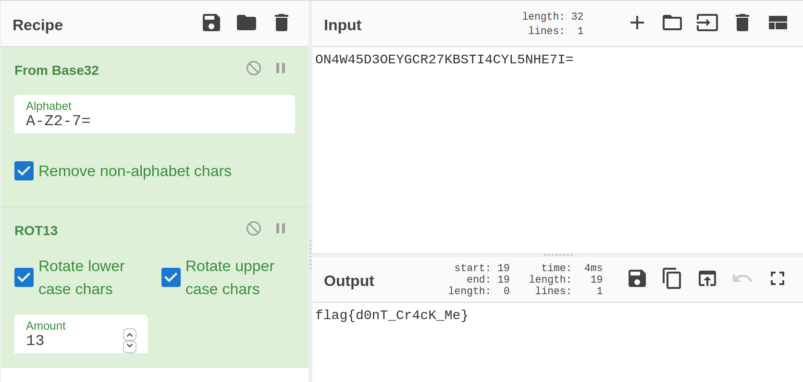

## Dont use Mac [unsolved]

- 题目描述：

  > 解答本题时请不要使用Mac。 
  >
  > By *FLAG挖掘机*
  >
  > hint: Plz, check everything you've got.	

 - [题目附件](https://cdn.jsdelivr.net/gh/SignorMercurio/MetasequoiaCTF@master/Misc/Don'tUseMac/attachment.zip)

 - 考察点：.DS_Store信息泄漏

 - 难度：简单

 - 初始分值：200

 - 最终分值：170

 - 完成人数：6

> 比赛的时候没有解出来，后来看了官方wp，其实就差一点点儿了
>
> 还是自己对各种常见加密不够敏感...wtcl

### 官方wp

解压缩包发现有一个文件夹和一张图片，图片里藏了压缩包，但实际上这里是误区，真正的flag是藏在`__MACOSX`文件夹下，这个文件夹通常是在解压缩的时候会存在，`__MACOSX` 中的`.DS_Store`里存在可疑字符串,通过Base32+ROT13即可得到答案。这里要注意的是，Mac上在解压缩的时候会在建立文件夹的时候覆盖掉`.DS_Store`，这也是题目名字的暗示。

### 复现

查找字符串：

```shell
$ rabin2 -zz ./__MACOSX/.DS_Store 
[Strings]
nth paddr      vaddr      len size section type    string
―――――――――――――――――――――――――――――――――――――――――――――――――――――――――
0   0x00000004 0x00000004 4   5            ascii   Bud1
1   0x00000060 0x00000060 4   5            ascii   bwsp
2   0x00000070 0x00000070 32  33           ascii   ON4W45D3OEYGCR27KBSTI4CYL5NHE7I=
3   0x0000020f 0x0000020f 8   17           utf16le \b__MACOS
4   0x00000220 0x00000220 8   9            ascii   bwspblob
5   0x0000022c 0x0000022c 8   9            ascii   bplist00
6   0x0000023b 0x0000023b 59  60           ascii   \a\b\b\n\b\n\r\n]ShowStatusBar[ShowPathbar[ShowToolbar[ShowTabView_
7   0x00000278 0x00000278 51  52           ascii   
8   0x000002ad 0x000002ad 26  27           ascii   {{370, 215}, {770, 436}}\t\b
9   0x000002c8 0x000002c8 12  13           ascii   %1=I`myz{|}~
10  0x000002f8 0x000002f8 8   17           utf16le \b__MACOS
11  0x00000309 0x00000309 8   9            ascii   lg1Scomp
12  0x0000031c 0x0000031c 8   17           utf16le \b__MACOS
13  0x0000032d 0x0000032d 8   9            ascii   moDDblob
14  0x00000348 0x00000348 6   13           utf16le _MACOS
15  0x00000355 0x00000355 8   9            ascii   modDblob
16  0x00000370 0x00000370 6   13           utf16le _MACOS
17  0x0000037d 0x0000037d 8   9            ascii   ph1Scomp
18  0x00000390 0x00000390 8   17           utf16le \b__MACOS
19  0x000003a1 0x000003a1 8   9            ascii   vSrnlong
20  0x00001411 0x00001411 4   5            ascii   DSDB

```

得到字符串：

> ON4W45D3OEYGCR27KBSTI4CYL5NHE7I=

解密：

